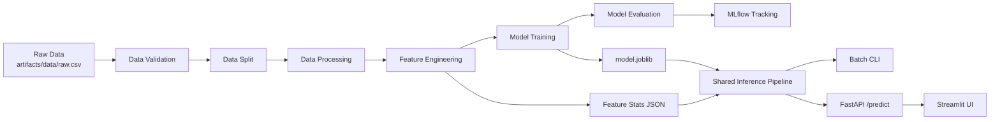

# ARES Architecture

This document describes how ARES is structured across training, inference, and serving layers, and how artifacts move between them.

## High-Level Topology

## Architectural Principles

- Single source of configuration: `config/config.yaml`, `params.yaml`, `schema.yaml`.
- Stage isolation: each stage reads declared inputs and writes stage-specific artifacts.
- Explicit gatekeeping: Data split only runs when validation status is `True`.
- Training-serving consistency: batch and online inference use the same feature pipeline.
- Artifact-driven runtime: inference relies on generated feature statistics and model artifacts.

## Stage Contracts

| Stage | Inputs | Outputs | Notes |
| --- | --- | --- | --- |
| Data Validation | `artifacts/data/raw.csv`, `schema.yaml` | `artifacts/data_validation/status.txt` | Fails fast on missing/extra columns or dtype mismatch |
| Data Split | raw CSV + validation status | `artifacts/data_split/train.csv`, `artifacts/data_split/eval.csv` | Stratified by locality group |
| Data Processing | split CSVs, optional Google Maps geocoding | `artifacts/data_processing/preprocessed_train.csv`, `artifacts/data_processing/preprocessed_eval.csv`, updated geocode cache | Normalization, outlier trimming, de-duplication |
| Feature Engineering | processed CSVs, schema cache, geocode cache | `features_train.csv`, `features_test.csv`, locality stats JSON files | Generates model-ready columns and locality priors |
| Model Training | engineered train/test features, hyperparameters | `artifacts/model_trainer/model.joblib` | CatBoost regression on `log_price` |
| Model Evaluation | model + engineered eval features | `artifacts/model_evaluation/metrics.json`, MLflow run | Logs params, metrics, model signature |

## Artifact Boundaries

ARES is artifact-first. Each stage publishes durable outputs under `artifacts/`.

- `artifacts/cache/`: reusable lookup files (schema cache, geocode cache).
- `artifacts/feature_engineering/*.json`: locality-level priors used at inference.
- `artifacts/model_trainer/model.joblib`: model consumed by API, CLI, and UI flows.
- `artifacts/model_evaluation/metrics.json`: local metric snapshot.
- `artifacts.zip`: deployment payload generated by `main.py`.

## Inference and Serving

### Shared Inference Layer

`src/ares/pipeline/inference.py` is the canonical inference implementation.

- Loads `model.joblib`.
- Loads locality statistics from feature engineering artifacts.
- Applies the same transformation logic used during training.
- Produces:
  - `estimated_price`
  - `lower_band`
  - `upper_band`
  - `market_volatility_idx`

### Online Serving Layer

- FastAPI app: `src/ares/api/main.py`.
- Primary endpoint: `POST /predict`.
- Health endpoints: `GET /`, `GET /health`.
- Request validation via Pydantic (`src/ares/api/schemas.py`).

### Presentation Layer

- Streamlit app: `app.py`.
- Calls FastAPI endpoint over HTTP.
- Uses `artifacts/cache/schema.json` to render form choices.

## Deployment View

The deployment workflow packages and serves API + UI in one container.

- `entrypoint.sh` launches:
  - FastAPI on `0.0.0.0:8000`
  - Streamlit on `${PORT:-8080}`
- GitHub Actions workflow `.github/workflows/deploy.yml` deploys to Google Cloud Run.

## Operational Risks and Controls

- Data schema drift: controlled through strict validation and schema contract.
- Training-serving skew: reduced by shared feature engineering logic.
- Geocoding dependency risk: mitigated through local cache (`artifacts/cache/geocode_cache.json`).
- Model observability: MLflow tracking + local metrics file.
