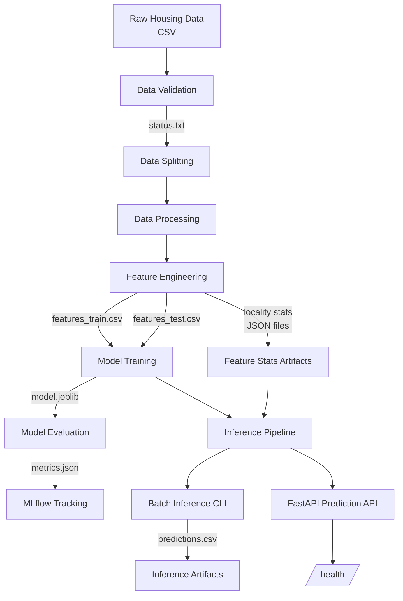

# Ares — System Architecture

This document describes the system architecture of **ARES**, focusing on data flow, component responsibilities, and artifact boundaries. It clarify how training, inference, and serving interact in the setup.

---

## System Diagram

---

## Component Responsibilities

### Data Validation

* Enforces schema defined in `schema.yaml`
* Checks column presence and dtypes
* Writes validation result to `status.txt`
* Acts as a gatekeeper for downstream stages

---

### Data Splitting

* Groups rare localities into `OTHER`
* Performs stratified train/eval split by locality
* Prevents geographic distribution shift between splits

---

### Data Processing

* Cleans and normalizes raw inputs
* Handles missing values and outliers
* Geocodes localities and updates geocode cache
* Produces processed train and evaluation datasets

---

### Feature Engineering

* Generates model-ready features
* Computes and persists locality-level statistics:

  * Price indices
  * Volatility measures (IQR, std)
  * Luxury and density metrics
* Saves all statistics as JSON artifacts for reuse

These artifacts are **required** for consistent inference.

---

### Model Training

* Trains a CatBoostRegressor on engineered features
* Target variable: `log_price`
* Saves trained model as `model.joblib`
* Computes MAE, RMSE, and R² on evaluation data

---

### Model Evaluation and Tracking

* Reloads trained model and test features
* Recomputes metrics for verification
* Logs parameters, metrics, and model artifact to MLflow
* Persists metrics locally as JSON

---

## Inference Architecture

### Shared Inference Pipeline

Both batch and online inference use the same pipeline:

* Loads trained model
* Loads feature statistics from training artifacts
* Applies identical feature transformations
* Computes point predictions and uncertainty bands

This design prevents training–serving skew.

---

### Batch Inference (CLI)

* Accepts raw CSV input
* Produces predictions with uncertainty bands
* Writes results to `artifacts/inference/predictions.csv`

---

### Online Inference (FastAPI)

* Exposes `/predict` endpoint
* Validates input via Pydantic schema
* Converts request to single-row DataFrame
* Returns estimated price and uncertainty bounds
* Provides `/` and `/health` endpoints for service checks

---

## Summary

Ares is an ML system where:

* Training and inference share identical feature logic
* State is explicit and inspectable
* Configuration, data, and models are cleanly separated
